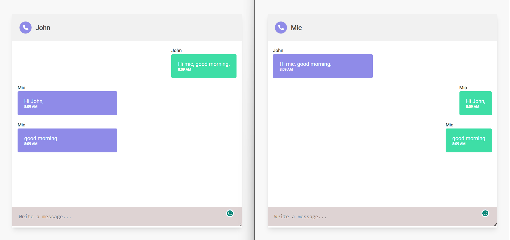

# WhatApp Chat App

## Description

This is a small WhatsApp Chat app build using Node,Express & Socket.io
## Screen-shots




### Installation

1. Install the dependencies:

   ```bash
   npm install
   ```

2. Start the application:

   ```bash
   npm start
   ```


## Acknowledgments

Give credit to any resources or individuals that helped or inspired the project.
