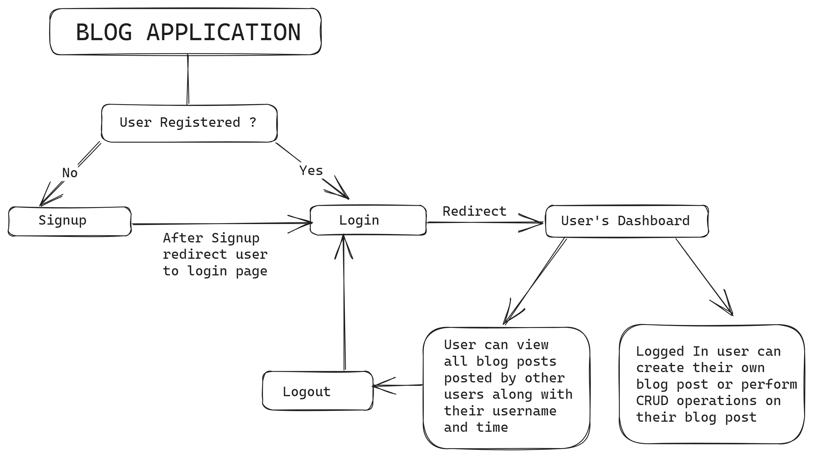

# Blog App backend API

A simple blogging app built using NodeJS, ExpressJS and MongoDb. Authenticated and authorization functions with passport

## System Design of the project


## Functions

- SignIn - Login into existing account.
- SignUp - Signup using username/email and password.
- Blog Post - LoggedIn user only can perform  ['add','update','delete','view'] operations post.
- Feeds - This is the home page of blog app that contain all blogs with username and created date.

## Postman Documentation

- A complete postman documentation has been provided with the project.

## Project Archietecture

```tree
├── app.ts
├── controller
    ├── blogPost.ts
│   ├── postFeeds.ts
│   └── userAuthentication.ts
├── middleware
    └── auth.ts
├── models
    ├── blacklistTokens.ts
│   ├── postSchema.ts
│   └── userSchema.ts
routes
    ├── apiRoutes.ts
├── node_modules
├── package.json
├── package-lock.json
├── public
├── validation.ts
├── tsconfig.json
├── googleAuth.json
├── readme.md


```

# How to run

- Git clone repository
- Then run these commands in terminal/shell

```npm
    npm install
    npm start
```